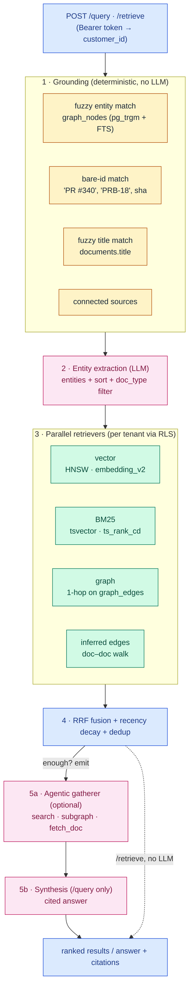

# Retrieval Architecture

How a query becomes a ranked, cited answer. This is the read-path companion to
[storage-architecture.md](storage-architecture.md) (which covers how data lands
at rest). If you want to understand — or adapt — how the engine retrieves, start
here.

## Mental model

A query is answered in five stages:

1. **Ground** it deterministically in what actually exists (SQL, no LLM).
2. **Extract** the entities and intent (one LLM call).
3. **Fan out** across complementary retrievers in parallel (vector + keyword +
   graph), each scoped to the tenant.
4. **Fuse** the candidate lists into one ranking (Reciprocal Rank Fusion).
5. Optionally let a small **agent** widen/deepen the gather, then **synthesize**
   a cited answer.

Nothing here is a single magic index. Recall comes from running several cheap,
independent retrievers and merging their rankings — so a result that several
retrievers agree on rises, and no single signal can dominate.



---

## Stage 1 — Grounding (deterministic)

Before any LLM runs, the engine grounds the raw query string against the
database with plain SQL ([`grounding.py`](../services/retrieval/grounding.py)).
Four channels run and return candidates the model can trust:

- **Fuzzy entity match** — `pg_trgm` + full-text search over
  `graph_nodes.properties->>'name'` to resolve people, PRs, tickets, features.
- **Bare-id match** — regex-extracts stable identifiers (`PR #340`, `PRB-18`,
  7-char commit shas) and exact-matches them in `graph_nodes`.
- **Fuzzy title match** — `pg_trgm` + FTS over `documents.title` for conceptual
  queries with no named entity.
- **Connected sources** — which integrations this tenant actually has wired, so
  the model never reaches for a source that isn't there.

The result is a `GroundingBundle`. If grounding errors, the pipeline degrades to
an empty bundle rather than failing the query.

## Stage 2 — Entity extraction (one LLM call)

The grounding bundle is rendered as context and handed to an extractor
([`agent/extractor.py`](../services/retrieval/agent/extractor.py)) that returns a
structured `EntityExtraction`: the entities to search, a `sort` intent
(`relevance` vs `recency`), and optional `doc_type` filters. Extracted entities
are reconciled against the grounding candidates so the model can't invent IDs
that don't exist. The model is configurable via `SEARCH_AGENT_INFERENCE_MODEL`;
on error the pipeline falls back to grounding-only retrieval.

## Stage 3 — Parallel retrievers

One `search` call fans out across complementary retrievers **in parallel**, each
running inside the tenant's RLS scope. They return a common hit shape
(`chunk_id`, `doc_id`, score, timestamps) so fusion can compare them.

| Retriever | Queries | What it's good at |
|---|---|---|
| **Vector** ([`vector.py`](../services/retrieval/retrievers/vector.py)) | pgvector **HNSW** ANN on `chunks.embedding_v2` (Gemini embeddings, 3072-dim, cosine) | semantic / paraphrase recall |
| **BM25** ([`bm25.py`](../services/retrieval/retrievers/bm25.py)) | `ts_rank_cd` cover-density over the `chunks` tsvector; query is an OR-of-tokens `to_tsquery` | exact terms, rare tokens, code identifiers |
| **Graph** ([`graph.py`](../services/retrieval/retrievers/graph.py)) | entity-anchored 1-hop walk over `graph_nodes`/`graph_edges` → `documents`, filtered by confidence tier | "what's connected to X" |
| **Inferred edges** ([`inferred_edges.py`](../services/retrieval/retrievers/inferred_edges.py)) | bidirectional walk over `INFERRED` doc–doc edges (`UNION ALL` on both endpoints) | discussions that reference each other across sources |
| **Directed / id-lookup / sql / related-entities** | exact-id boosts, deterministic windowed listing, neighbor entities | precise-id, "list/aggregate", graph context |

Every retriever respects the same filters: temporal window (`latest` /
`as_of` / `changed_between`), draft visibility (public API sees
`visibility = 'approved'` only), author and source-system filters, doc-type
filters, and the `recency` vs `relevance` sort.

> **Bidirectional graph walks use `UNION ALL`, not `OR`** — Postgres won't
> reliably combine two single-column edge indexes with a bitmap-OR, so
> `from_node = X OR to_node = X` is split into two indexed scans and unioned.

## Stage 4 — Fusion

Candidate lists are merged with **Reciprocal Rank Fusion**
([`fusion.py`](../services/retrieval/fusion.py)):

```
score(chunk) = Σ_retrievers  1 / (RRF_K + rank_in_retriever)
```

RRF is rank-based, so retrievers with incompatible score scales (cosine distance
vs `ts_rank_cd` vs graph surprise) combine without normalization. On top of the
base score:

- **Doc-grouped scoring** — content chunks compete for the global top-k; extra
  matching chunks in the same doc add a breadth bonus, so a doc that matches in
  several places outranks a one-line fluke.
- **Recency decay** — an exponential half-life applied per source at the doc
  level (a fresh doc can still be demoted by a low source multiplier).
- **Dedup** — near-identical chunks (cosine > the dedup threshold) collapse to
  the higher-ranked one ([`dedup.py`](../services/retrieval/dedup.py)).

All of the knobs — `RRF_K`, the breadth alpha, dedup threshold, per-source
half-lives and score multipliers, per-retriever top-k — live in one place,
[`shared/constants.py`](../shared/constants.py). That's the file to read (and
tune) if you want to change ranking behavior.

## Stage 5 — Agentic gather + synthesis

If the parallel fan-out returns nothing, the pipeline **short-circuits** and
returns empty (no LLM spend). Otherwise an optional **gatherer agent**
([`agent/loop.py`](../services/retrieval/agent/loop.py)) gets the fused
candidates and a small, bounded toolset to widen or deepen the gather:

- `search(queries, entity_ids?)` — re-issue the parallel fan-out with
  reformulated queries or re-grounded entities.
- `subgraph(anchor, depth, edge_types?)` — multi-hop BFS (depth 1–3) around an
  entity, with alias expansion.
- `fetch_doc(doc_id)` — pull a document's full chunks and outbound edges.
- `need_deeper(reason)` — request a bounded budget extension.
- `emit_gatherer_output(...)` — **terminal**; ends the loop and returns the
  gathered entities + chunks.

The loop runs under a tool-call budget and wall-clock timeout (both in
`shared/constants.py`), with `tool_choice` forced so the model always acts
rather than narrating. The run is seeded with `sha256(customer_id, query)` for
reproducibility. The gatherer's job is **recall, not answering** — it decides
*what to fetch*, not what to say.

`POST /query` then runs **synthesis** ([`synthesis.py`](../services/retrieval/synthesis.py)):
the gathered chunks are passed to an LLM (default Claude Sonnet, set via the
synthesis model config) that returns a structured answer with **citations** and
an `insufficient_context` flag when the evidence doesn't support a claim.
`POST /retrieve` skips this stage and returns the ranked chunks directly.

---

## Tenant isolation on the read path

Every read runs inside `with_tenant(customer_id)`, which sets the Postgres GUC
`app.current_customer_id` for the transaction. RLS policies on `graph_nodes`,
`graph_edges`, and `documents` enforce `customer_id = current_setting('app.current_customer_id')`,
so a query physically cannot read another tenant's rows even if application code
forgets a `WHERE` clause.

In **community / self-host** mode there is one tenant: every request is scoped to
`DEFAULT_CUSTOMER_ID` and authenticated by the static `KNOWLEDGE_API_TOKEN`
bearer. The exact same code runs multi-tenant when a control plane supplies
per-request `customer_id`s — the isolation primitive doesn't change, only how
many tenants exist.

## HTTP API surface

All endpoints take `Authorization: Bearer <KNOWLEDGE_API_TOKEN>` (community) and
return the tenant-scoped view. (`/health` is unauthenticated.)

| Endpoint | Purpose |
|---|---|
| `POST /retrieve` | Ranked chunks (stages 1–4, plus gatherer) — no synthesis |
| `POST /query` | `/retrieve` + an LLM-synthesized, cited answer |
| `POST /query/stream` | Same as `/query` over SSE (`refining → entities → searching → synthesizing → done`) |
| `POST /graph/explore` | Knowledge-graph view: top-N by degree, or tiered BFS around an anchor |
| `POST /graph/search` | Prefix typeahead for the graph anchor picker |
| `GET /sources/{doc_id}` | Reassembled full source content for a document |
| `GET /health` | Liveness + DB ping |

The MCP server (`services/mcp/`) is a thin proxy over `/query`, `/retrieve`, and
source fetch — see the [README MCP section](../README.md#mcp-server).

---

## Where to adapt it

| You want to… | Look at |
|---|---|
| Change ranking / weighting | [`shared/constants.py`](../shared/constants.py) (`RRF_K`, half-lives, source multipliers, top-k) |
| Add or swap a retriever | [`services/retrieval/retrievers/`](../services/retrieval/retrievers/) + register it in [`pipeline.py`](../services/retrieval/pipeline.py) |
| Change how fusion combines signals | [`fusion.py`](../services/retrieval/fusion.py) |
| Change the embedding model/dims | embedding config in `shared/constants.py` (must match the `chunks.embedding_v2` column dimension) |
| Change the gatherer's tools or budget | [`agent/tools.py`](../services/retrieval/agent/tools.py), [`agent/loop.py`](../services/retrieval/agent/loop.py) |
| Change the answer format / citations | [`synthesis.py`](../services/retrieval/synthesis.py) |
| Swap LLM providers | set `SEARCH_AGENT_INFERENCE_MODEL` / the synthesis model — calls route through a provider-agnostic client |

The retrieval ranking constants are intentionally centralized in
`shared/constants.py` (not scattered as env vars) precisely so they're easy to
read, diff, and tune.
