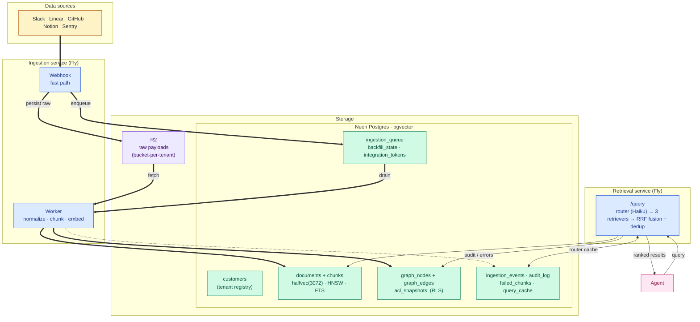
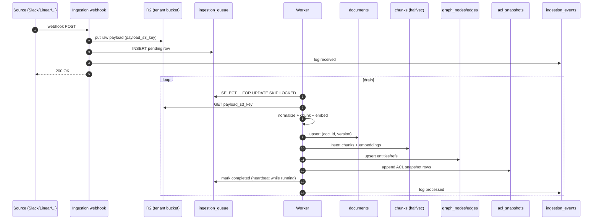

# Storage Architecture

How data flows through prbe-knowledge and where it lands at rest.

Two stores:

- **Cloudflare R2** — one bucket per tenant, holds raw webhook payloads verbatim (replay + debug).
- **Neon Postgres 16 + pgvector** — all structured state. 13 Phase 0 tables grouped by role below.

---

## End-to-end data flow

Five horizontal bands, read top to bottom. Thick arrows are the write path; thin arrows are the read path.



Tenancy: every customer-scoped table has a `customer_id` FK to `customers` (ON DELETE CASCADE). `graph_nodes` and `graph_edges` additionally enforce isolation via Postgres RLS — the app sets `app.current_customer_id` at the start of each transaction.

---

## Write path (ingestion)



Fast-path guarantee: webhook returns 200 after raw payload is durable in R2 and a queue row exists. All parsing happens in the worker so webhook latency is bounded.

---

## Read path (retrieval)

```mermaid
sequenceDiagram
    autonumber
    participant Ag as Agent
    participant R as Retrieval /query
    participant QC as query_cache
    participant V as Vector (HNSW on chunks.embedding)
    participant B as BM25 (GIN FTS on chunks + documents)
    participant Gr as Graph (nodes + edges, RLS)
    participant F as RRF fusion + dedup

    Ag->>R: query + customer_id
    R->>QC: lookup(query_hash)
    alt cache hit
        QC-->>R: entities + expansions
    else cache miss
        R->>R: Haiku router extracts entities
        R->>QC: store (1h TTL)
    end
    par parallel retrieval
        R->>V: top-k cosine via halfvec_cosine_ops
        R->>B: to_tsvector match
        R->>Gr: SET app.current_customer_id; traverse
    end
    V-->>F: ranked chunks
    B-->>F: ranked chunks/docs
    Gr-->>F: related nodes
    F-->>Ag: fused, deduped results
```

---

## Storage-layer cheat sheet

| Table | Role | Key indexes |
|---|---|---|
| `customers` | tenant registry; FK parent (ON DELETE CASCADE) | PK `customer_id` |
| `documents` | canonical normalized form, versioned per `(doc_id, version)` | GIN FTS on title+preview, GIN on `entities`/`metadata` |
| `chunks` | retrieval unit; holds full body inline + `halfvec(3072)` embedding | HNSW `halfvec_cosine_ops`, GIN FTS on content |
| `graph_nodes` / `graph_edges` | relational graph (AGE not available on Neon Scale) | RLS `tenant_isolation` via `app.current_customer_id` |
| `acl_snapshots` | temporal source ACLs, ingested now, enforced Phase 1 | `(principal)`, `(resource)` over `valid_from DESC` |
| `ingestion_queue` | backpressure buffer; worker drains with SKIP LOCKED | partial indexes on `pending` / `processing` |
| `backfill_state` | resumable pagination cursor per `(customer, source)` | PK `(customer_id, source_system)` |
| `integration_tokens` | OAuth creds, encrypted at rest | partial index on refresh errors |
| `ingestion_events` | replay/debug log, one row per webhook | `(customer, received_at DESC)` |
| `audit_log` | append-only actor trail (Phase 2+ enterprise audit) | `(customer, occurred_at DESC)` |
| `failed_chunks` | embedding-batch reject isolator (recursive half-split) | `(customer, failed_at DESC)` |
| `query_cache` | router (Haiku) output cache, 1h TTL | `(customer, query_text_hash)` |

Tenant isolation: every customer-scoped table carries `customer_id` with a CASCADE FK to `customers`. Graph tables additionally enforce isolation via Postgres RLS — the app sets `app.current_customer_id` at the start of each transaction.

Source of truth for the schema: [`db/schema.sql`](../db/schema.sql). Alembic's initial migration is generated from it.
