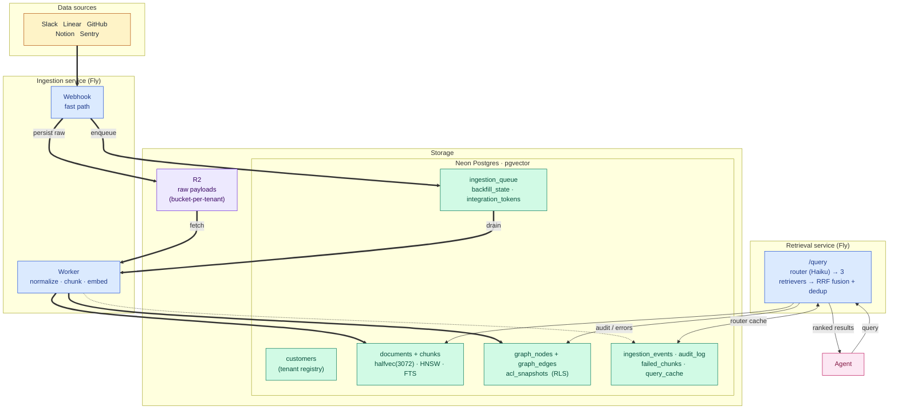
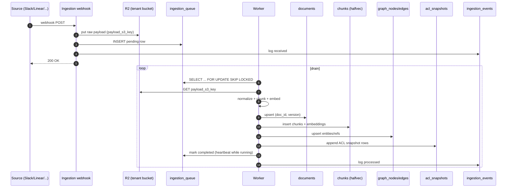

# Storage Architecture

How data flows through prbe-knowledge and where it lands at rest.

Two stores:

- **Cloudflare R2** — one bucket per tenant, holds raw webhook payloads verbatim (replay + debug).
- **Neon Postgres 16 + pgvector** — all structured state. 13 Phase 0 tables grouped by role below.

---

## End-to-end data flow

Five horizontal bands, read top to bottom. Thick arrows are the write path; thin arrows are the read path.

```mermaid
flowchart TB
    classDef src     fill:#fef3c7,stroke:#b45309,color:#1f2937;
    classDef svc     fill:#dbeafe,stroke:#1d4ed8,color:#1e3a8a;
    classDef blob    fill:#ede9fe,stroke:#6d28d9,color:#3b0764;
    classDef pg      fill:#d1fae5,stroke:#047857,color:#064e3b;
    classDef agent   fill:#fce7f3,stroke:#be185d,color:#831843;

    %% ---------- 1. Sources ----------
    subgraph L1["Data sources"]
        direction LR
        SRC["Slack &nbsp; Linear &nbsp; GitHub &nbsp; Notion &nbsp; Sentry"]:::src
    end

    %% ---------- 2. Ingestion ----------
    subgraph L2["Ingestion service (Fly)"]
        direction LR
        WH["Webhook<br/>fast path"]:::svc
        WK["Worker<br/>normalize · chunk · embed"]:::svc
    end

    %% ---------- 3. Storage ----------
    subgraph L3["Storage"]
        direction LR
        R2["R2<br/>raw payloads<br/>(bucket-per-tenant)"]:::blob

        subgraph PG["Neon Postgres · pgvector"]
            direction TB
            CUST["customers<br/>(tenant registry)"]:::pg
            CONTENT["documents + chunks<br/>halfvec(3072) · HNSW · FTS"]:::pg
            GRAPH["graph_nodes + graph_edges<br/>acl_snapshots &nbsp;(RLS)"]:::pg
            QUEUE["ingestion_queue<br/>backfill_state · integration_tokens"]:::pg
            OPS["ingestion_events · audit_log<br/>failed_chunks · query_cache"]:::pg
        end
    end

    %% ---------- 4. Retrieval ----------
    subgraph L4["Retrieval service (Fly)"]
        direction LR
        RS["/query<br/>router (Haiku) → 3 retrievers → RRF fusion + dedup"]:::svc
    end

    %% ---------- 5. Consumer ----------
    AG["Agent"]:::agent

    %% Write path (thick)
    SRC ==> WH
    WH  ==>|persist raw| R2
    WH  ==>|enqueue| QUEUE
    QUEUE ==>|drain| WK
    R2  ==>|fetch| WK
    WK  ==> CONTENT
    WK  ==> GRAPH
    WK  -.->|audit / errors| OPS

    %% Read path (thin)
    AG  -->|query| RS
    RS  --> CONTENT
    RS  --> GRAPH
    RS  <-->|router cache| OPS
    RS  -->|ranked results| AG
```

Tenancy: every customer-scoped table has a `customer_id` FK to `customers` (ON DELETE CASCADE). `graph_nodes` and `graph_edges` additionally enforce isolation via Postgres RLS — the app sets `app.current_customer_id` at the start of each transaction.

---

## Write path (ingestion)

```mermaid
sequenceDiagram
    autonumber
    participant Src as Source (Slack/Linear/...)
    participant Web as Ingestion webhook
    participant R2 as R2 (tenant bucket)
    participant Q as ingestion_queue
    participant W as Worker
    participant Docs as documents
    participant Ch as chunks (halfvec)
    participant G as graph_nodes/edges
    participant A as acl_snapshots
    participant Ev as ingestion_events

    Src->>Web: webhook POST
    Web->>R2: put raw payload (payload_s3_key)
    Web->>Q: INSERT pending row
    Web->>Ev: log received
    Web-->>Src: 200 OK

    loop drain
        W->>Q: SELECT ... FOR UPDATE SKIP LOCKED
        W->>R2: GET payload_s3_key
        W->>W: normalize + chunk + embed
        W->>Docs: upsert (doc_id, version)
        W->>Ch: insert chunks + embeddings
        W->>G: upsert entities/refs
        W->>A: append ACL snapshot rows
        W->>Q: mark completed (heartbeat while running)
        W->>Ev: log processed
    end
```

Fast-path guarantee: webhook returns 200 after raw payload is durable in R2 and a queue row exists. All parsing happens in the worker so webhook latency is bounded.

---

## Read path (retrieval)

```mermaid
sequenceDiagram
    autonumber
    participant Ag as Agent
    participant R as Retrieval /query
    participant QC as query_cache
    participant V as Vector (HNSW on chunks.embedding)
    participant B as BM25 (GIN FTS on chunks + documents)
    participant Gr as Graph (nodes + edges, RLS)
    participant F as RRF fusion + dedup

    Ag->>R: query + customer_id
    R->>QC: lookup(query_hash)
    alt cache hit
        QC-->>R: entities + expansions
    else cache miss
        R->>R: Haiku router extracts entities
        R->>QC: store (1h TTL)
    end
    par parallel retrieval
        R->>V: top-k cosine via halfvec_cosine_ops
        R->>B: to_tsvector match
        R->>Gr: SET app.current_customer_id; traverse
    end
    V-->>F: ranked chunks
    B-->>F: ranked chunks/docs
    Gr-->>F: related nodes
    F-->>Ag: fused, deduped results
```

---

## RLS and index usage

Every customer-scoped table is behind `ENABLE` + `FORCE ROW LEVEL SECURITY`,
and the retrieval service is deliberately not `BYPASSRLS`. That is the isolation
guarantee — a forgotten `WHERE customer_id = ...` is a bug, not a breach — and
it constrains query planning in a way that is invisible until something is
mysteriously slow.

**The rule.** RLS makes the tenant qual a *security barrier*. The planner may
evaluate another qual *below* that barrier only if it is provably `LEAKPROOF`,
because evaluating a function against rows the caller may not see can reveal
that those rows exist — through an error raised only on certain inputs, or
through timing. A qual that cannot go below the barrier runs *after* filtering,
and a predicate that runs after filtering cannot be used to *locate* rows. So it
cannot drive an index scan.

**What this does and does not affect.** It is not "RLS breaks indexes." Measured
on this schema:

| Access path | Indexed under RLS? |
|---|---|
| Plain column predicates (btree equality, `customer_id`) | yes |
| pg_search / ParadeDB `@@@` | yes |
| pgvector HNSW (`halfvec_cosine_ops`) | yes |
| **Expression indexes** (index on `to_tsvector(...)`) | **no — see below** |
| **Non-leakproof operators** (`%` via `similarity_op`, `@@` via `ts_match_vq`) | **no** |

This is why the vector and BM25 channels of the pre-fan-out were never slow,
and why the grounding channel was.

**Expression indexes are unusable under RLS regardless of LEAKPROOF.** Matching
one means evaluating the *indexed expression* below the barrier, which the
planner declines under RLS even when every function involved is marked
leakproof. Measured on the managed plane (tenant `probe-founders`, role
`probe_app`, `row_security = on`), single probe:

    expression index                             1052 ms
    same, with to_tsvector/ts_match_vq marked
      LEAKPROOF                                   874 ms   <- still not indexed
    STORED generated column + index on it           23 ms

The fix is to remove the expression: materialize it as a `STORED GENERATED`
column so the query references a **plain column**, which needs no below-barrier
evaluation at all. Migration `0109` did this for `documents.title_preview_tsv`
and cut the full grounding predicate 1052 ms -> 238 ms with no semantic change
and no security decision. Note the win came from *precomputation*, not from the
new index — which still shows zero scans.

If you add a GIN/GiST index on an expression over an RLS table, assume it will
never be used and materialize instead.

### LEAKPROOF: an available lever, deliberately not taken

The residual cost in grounding is the trigram arm — `documents.title % $2` —
where the blocker is the *operator* rather than an expression wrapping it.
`ALTER FUNCTION similarity_op(text, text) LEAKPROOF` would let it use
`idx_documents_title_trgm`. Recorded in `0109` as worth roughly the remaining
9x on that predicate.

**Status: open, deliberately deferred (2026-08-19). Not a bug, not an
oversight, and not to be applied as a routine tuning step.**

What you would be trading:

- *Access control is unchanged.* RLS still filters the result set; no tenant can
  retrieve another tenant's row, leakproof or not.
- *Inference resistance is weakened.* The operator would be evaluated against
  index entries spanning all tenants, so query cost comes to depend weakly on
  how much of the whole corpus matches the search term — a low-bandwidth
  cross-tenant cardinality oracle via timing.
- The classic error-channel attack needs a caller who can submit arbitrary SQL
  predicates. Ours cannot: the operator is fixed by our code and only the bound
  parameter is tenant-supplied. The timing channel survives that, and is the
  honest residual.
- `ALTER FUNCTION ... LEAKPROOF` requires superuser and is **database-global**.
  It cannot be scoped to one column or one table. It would apply to `%` on every
  RLS table we have and every one added later — including `graph_nodes`, which
  still carries an unfixed version of this same problem.

That last asymmetry is the argument against it today: a permanent, global,
questionnaire-disclosable property spent on one arm of one code path, while p90
is pinned by an unrelated stage cap.

**Measure these before acting.** Both are unverified, and the first could make
the second moot:

1. *Where the residual time actually goes.* Btree equality is itself leakproof,
   so the tenant qual may already be index-driven and `%` may be running over
   just this tenant's rows. A comment in `grounding.py` records `title % $2`
   planning as `BitmapOr` across both indexes at 77 ms — which does not obviously
   square with the ~9x claim, and the two were measured at different times under
   different RLS settings. Reconcile them first.
2. *Whether `LIST` partitioning on `customer_id` prunes under RLS.*
   `current_setting()` is stable, so runtime pruning should apply at the executor
   and confine the scan without touching the barrier — full RLS preserved, no
   waiver, no table-per-tenant sprawl.

Both are cheap to check inside a rolled-back transaction on the managed plane,
which is how `0109` was validated before it shipped.

**Note for the schema guards.** `index_contracts.py` compares predicate text
against index expression text. It cannot detect an RLS-blocked index and
reported 4/4 green throughout the `0109` incident while the query was
seq-scanning. Treat it as silent on this failure mode.

---

## Storage-layer cheat sheet

| Table | Role | Key indexes |
|---|---|---|
| `customers` | tenant registry; FK parent (ON DELETE CASCADE) | PK `customer_id` |
| `documents` | canonical normalized form, versioned per `(doc_id, version)` | GIN FTS on title+preview, GIN on `entities`/`metadata` |
| `chunks` | retrieval unit; holds full body inline + `halfvec(3072)` embedding | HNSW `halfvec_cosine_ops`, GIN FTS on content |
| `graph_nodes` / `graph_edges` | relational graph (AGE not available on Neon Scale) | RLS `tenant_isolation` via `app.current_customer_id` |
| `acl_snapshots` | temporal source ACLs, ingested now, enforced Phase 1 | `(principal)`, `(resource)` over `valid_from DESC` |
| `ingestion_queue` | backpressure buffer; worker drains with SKIP LOCKED | partial indexes on `pending` / `processing` |
| `backfill_state` | resumable pagination cursor per `(customer, source)` | PK `(customer_id, source_system)` |
| `integration_tokens` | OAuth creds, encrypted at rest | partial index on refresh errors |
| `ingestion_events` | replay/debug log, one row per webhook | `(customer, received_at DESC)` |
| `audit_log` | append-only actor trail (Phase 2+ enterprise audit) | `(customer, occurred_at DESC)` |
| `failed_chunks` | embedding-batch reject isolator (recursive half-split) | `(customer, failed_at DESC)` |
| `query_cache` | router (Haiku) output cache, 1h TTL | `(customer, query_text_hash)` |

Tenant isolation: every customer-scoped table carries `customer_id` with a CASCADE FK to `customers`. Graph tables additionally enforce isolation via Postgres RLS — the app sets `app.current_customer_id` at the start of each transaction.

Source of truth for the schema: [`db/schema.sql`](../db/schema.sql). Alembic's initial migration is generated from it.
